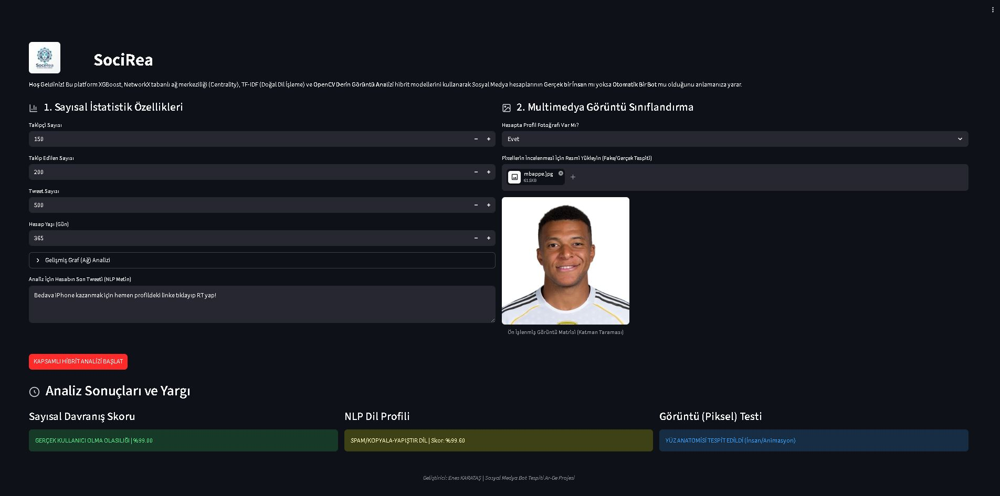

# SociRea | Sosyal Medya Bot Tespiti

Merhaba! Bu repo, Bulut Bilişim ve Yapay Zeka Teknolojileri dersi için hazırladığım "İkili Sınıflandırma (Binary Classification)" projemi içermektedir. 

Projemin amacı, sosyal medya platformlarındaki kullanıcıların gerçek bir insan mı yoksa sahte bir bot hesap mı (0 veya 1) olduğunu tespit edebilmektir. Bunu yaparken sadece hesabın takipçi sayısı, atılan tweet sayısı gibi verilere bakmakla kalmayıp; kişinin profil fotoğrafını ve attığı son tweetin metnini de analiz eden bir yapı kurmaya çalıştım.

## Projede Neler Kullandım?

Projeyi geliştirirken farklı kütüphanelerden ve yöntemlerden faydalandım:
1. **Makine Öğrenmesi (XGBoost):** Kullanıcıların takipçi/takip edilen oranı, hesap yaşı, attığı toplam tweet, takipçi-takip edilen sayısı gibi verileri alıp XGBoost algoritması ile eğittim. Modelin test setindeki doğruluk oranı %96.60 seviyesinde çıktı.
2. **Doğal Dil İşleme (NLP):** Hesabın attığı son tweeti alıp, bunun otomatik oluşturulmuş bir spam metni mi yoksa normal bir insan cümlesi mi olduğunu anlamak için TF-IDF ve Lojistik Regresyon kullandım.
3. **Görüntü İşleme (OpenCV):** Bazen botlar profil fotoğrafı koymaz veya sadece rastgele bir resim/logo koyarlar. Kullanıcının yüklediği profil fotoğrafında bir insan yüzü olup olmadığını tespit etmek için OpenCV kütüphanesi (Haar Cascades) ile bir yüz tarama kontrolü ekledim.
4. **Graf Teorisi:** Kullanıcının ağ içerisindeki konumunu (Derece Merkeziliği vb.) ek parametre olarak da modelime sundum.
5. **Agent-AI Kullanımı:** Tüm bu geliştirmeleri yaparken Antigravity, ChatGPT, Claude gibi yapay zeka agent ve dil modellerinden yararlandım.

## Dosya Yapısı
Proje klasörümün yapısı şu şekildedir:
- [**/app**](./app): Streamlit arayüz kodlarının (app.py) bulunduğu klasör.
- **/data**: Eğitim için kullandığım Cresci-2017 veri setinin bulunduğu klasör (İçerisinde 14.368 adet kullanıcı profili ve toplam 103.804 satırlık tweet/etkileşim verisi bulunduğu için GitHub boyut sınırını aşmaktadır, bu sebeple gizlenmiştir).
- [**/models**](./models): Eğittiğim modellerin (.pkl uzantılı) kaydedildiği klasör.
- [**/notebooks**](./notebooks): Model eğitimini ve veri hazırlığını yaptığım Jupyter Notebook dosyaları.
- [**README.md**](./README.md): Şu an okuduğunuz proje açıklama dosyası.
- [**Proje_Raporu_SociRea.md**](./Proje_Raporu_SociRea.md): Projenin teknik detaylarını kendi kelimelerimle anlattığım proje raporum.
- [**requirements.txt**](./requirements.txt): Projenin çalışması için gereken kütüphanelerin listesi.
- [**socirea_baslat.bat**](./socirea_baslat.bat): Arayüzü Windows'ta tek tıkla çalıştırmak için yazdığım kısa script.

## Uygulamanın ekran görüntüsü (arayüz ve sonuç)
Aşağıda projemin Streamlit arayüzünün ve model analiz sonuçlarının bir ekran görüntüsünü görebilirsiniz:

## Kısa demo videosu
Projenin canlı olarak nasıl çalıştığını gösteren sunum videomu aşağıdan izleyebilirsiniz:
🔗 **[Demo Videosunu İzlemek İçin Buraya Tıklayın](https://youtu.be/uGu_FxVG6-0?si=t4U6WxUD9xGrbNs9)**

## Nasıl Çalıştırılır?
Projeyi kendi bilgisayarınızda denemek isterseniz şu adımları izleyebilirsiniz:

1. Bu repoyu bilgisayarınıza indirin.
2. Proje klasörünün içinde terminal veya komut satırını açın.
3. Gerekli kütüphaneleri kurmak için şu komutu çalıştırın:
   `pip install -r requirements.txt`
4. Kurulum bittikten sonra Streamlit arayüzünü başlatmak için terminale şunu yazın:
   `streamlit run app/app.py`
5. Eğer Windows kullanıyorsanız doğrudan `baslat.bat` dosyasına çift tıklayarak da arayüzü açabilirsiniz.
6. Hiç uğraşmak istemiyorsanız ; https://www.socirea.com adresine giderek de arayüzü açabilirsiniz.

Arayüz açıldığında sol taraftan test etmek istediğiniz hesabın istatistiklerini ve son tweet metnini girebilir, sağ taraftan da profil fotoğrafını yükleyerek bot olup olmadığını test edebilirsiniz.

**Geliştirici:** Enes KARATAŞ
